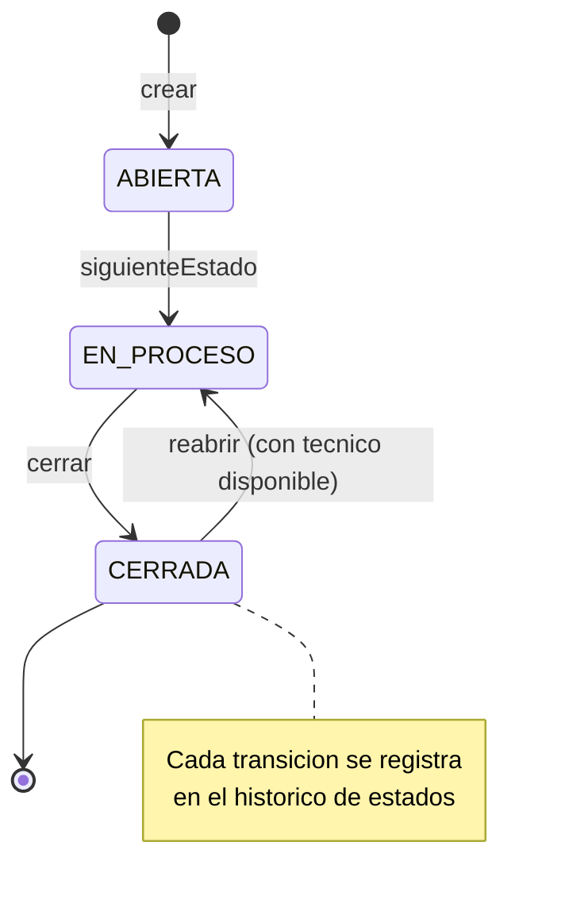
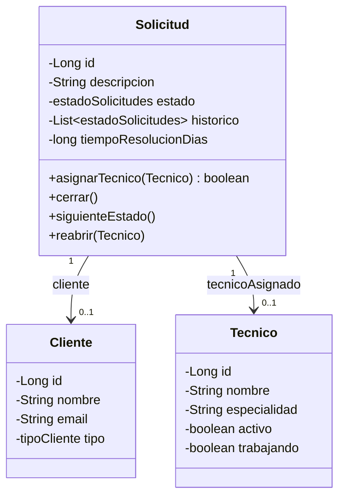
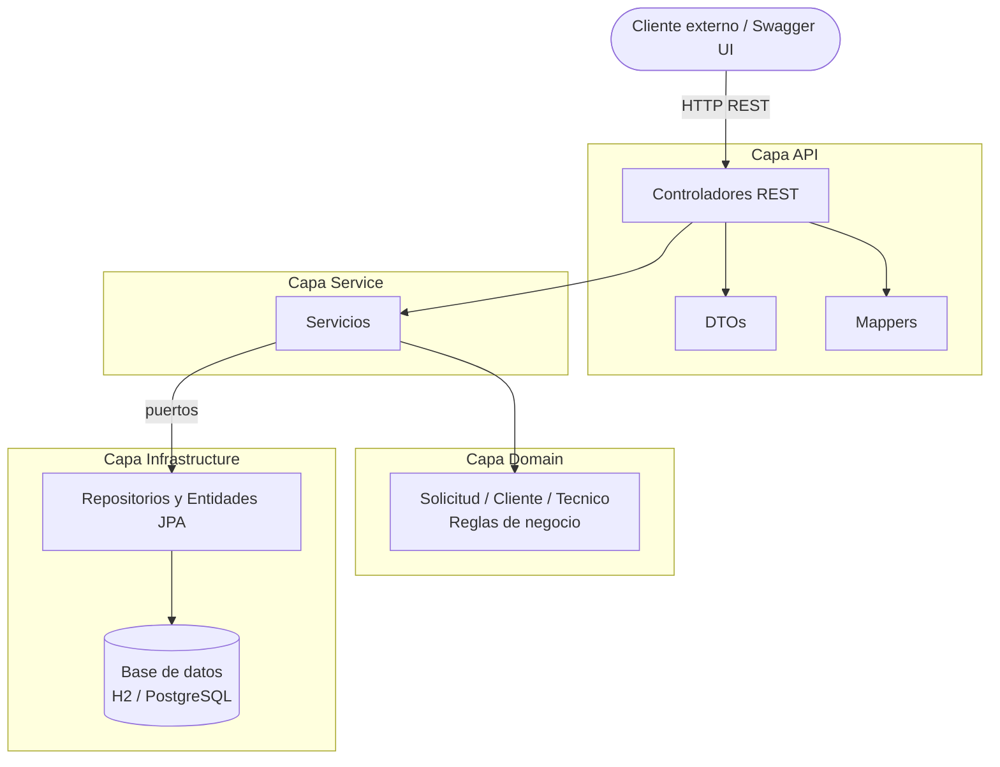
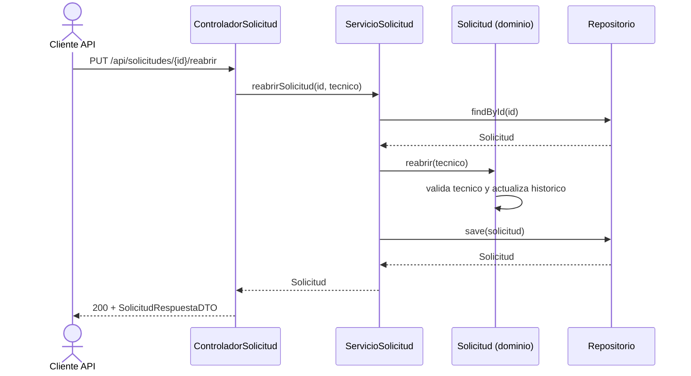
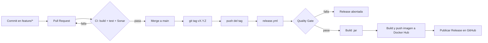

# Memoria Técnica — MGCSS-Track (Grupo 7)

Sistema de gestión de solicitudes de servicio técnico. Este documento resume las
decisiones de diseño, cómo instalar y probar el proyecto, las métricas de calidad
obtenidas y el estado de la deuda técnica.

---

## Documentación
- [Casos de uso](./docs/use-cases.md)
- [Análisis de cambios](./docs/change-analysis.md)
- [Notas de refactorización](./docs/refactor-notes.md)
- [Notas de release y versionado](./docs/release-notes.md)

### útiles
- [Guía Cheatsheet tags](./docs/cheatsheet-tag.md)
- [Guía Conventional commits](./docs/conventional-commits.md)

## 1. Descripción del proyecto

MGCSS-Track permite a una organización registrar **solicitudes** de servicio, asignarlas
a **técnicos**, controlar su estado y mantener un histórico de los cambios. Los clientes
pueden ser `STANDARD` o `PREMIUM`, y esa categoría influye en el tiempo máximo de
resolución (SLA).

Entidades principales:
- **Cliente** — `id`, `nombre`, `email`, `tipo` (STANDARD / PREMIUM).
- **Técnico** — `id`, `nombre`, `especialidad`, `activo`, `trabajando`.
- **Solicitud** (entidad central) — `id`, `cliente`, `descripción`, `estado`
  (ABIERTA → EN_PROCESO → CERRADA), `técnicoAsignado`, fechas e histórico de estados.

El ciclo de vida de una solicitud y sus transiciones de estado son el núcleo del sistema:



Relación entre las tres entidades del dominio:



---

## 2. Arquitectura y decisiones de diseño

El proyecto sigue una **arquitectura por capas** con separación clara de
responsabilidades, tal y como exige el enunciado:

```
domain          → Reglas de negocio (Solicitud, Cliente, Tecnico). Sin JPA.
service         → Orquestación de casos de uso (ServicioSolicitud, ...).
infrastructure  → Persistencia: entidades JPA, repositorios y adaptadores.
api             → Controladores REST, DTOs y mappers.
```



El flujo de una petición es: el **controlador** recibe un DTO, lo traduce al dominio con un
**mapper**, delega en el **servicio**, que aplica las reglas del **dominio** y persiste a
través de un **repositorio** (puerto). La respuesta vuelve convertida de nuevo a DTO.

Como ejemplo concreto, así viaja una petición de **reabrir solicitud** por las capas:



### Decisiones tomadas y por qué

| Decisión | Motivo |
|---|---|
| **Dominio sin anotaciones JPA** | Las clases de `domain` son objetos Java puros. La persistencia vive en clases `...Entidad` aparte. Así el modelo de negocio no depende de la base de datos y es fácil de probar. |
| **Reglas de negocio dentro del dominio** | Métodos como `cerrar()`, `asignarTecnico()` o `reabrir()` están en la entidad `Solicitud`, no en los servicios. Los servicios solo orquestan. Esto evita un "modelo anémico". |
| **Setters restringidos** | El `estado` y el `tecnicoAsignado` no tienen setter público (`@Setter(AccessLevel.NONE)`). Solo se cambian a través de métodos que respetan las reglas, evitando estados inconsistentes. |
| **Repositorios como interfaces (puertos)** | Los servicios dependen de interfaces (`SolicitudRepositorio`), no de Spring Data directamente. La implementación (`...RepositorioImpl`) traduce entre dominio y entidad JPA usando `JpaSolicitudRepositorio`. |
| **DTOs separados de las entidades** | La API nunca expone la entidad JPA. Se usan `...PeticionDTO` (entrada) y `...RespuestaDTO` (salida) para tener un contrato estable de cara al exterior. |
| **Mappers manuales** | El paso entidad ↔ DTO se hace con clases mapper sencillas (`SolicitudMapeo`, etc.) en vez de una librería externa. Para el tamaño del proyecto es más simple y transparente. |
| **Lombok** | Genera getters/setters y constructores, reduciendo código repetitivo (ver `docs/refactor-notes.md`). |
| **Histórico como lista** | El histórico de estados se guarda como `List<estadoSolicitudes>` (principio KISS) en lugar de una entidad propia. Justificación en `docs/change-analysis.md`. |
| **SLA según tipo de cliente** | Las solicitudes de clientes PREMIUM tienen un plazo de resolución más corto (24 días) que las STANDARD (48 días). |
| **H2 en desarrollo, PostgreSQL en producción** | Base de datos en memoria (H2) para desarrollo y tests rápidos; PostgreSQL en el perfil `prod`. La configuración se externaliza con variables de entorno. |

### Evolución (gestión del cambio)

Durante la Entrega 4 se aplicó un cambio sobre la entidad central: permitir **reabrir**
solicitudes cerradas y mantener un **histórico** de estados. Se gestionó de forma
controlada (análisis de impacto previo en `docs/change-analysis.md`, desarrollo con TDD y
verificación de regresión) sin romper el comportamiento anterior.

---

## 3. Instrucciones de instalación

La aplicación expone su API en `http://localhost:8080` y la documentación Swagger en
`http://localhost:8080/swagger-ui.html`.

> Las versiones publicadas están en la sección **Releases** del repositorio de GitHub y la
> imagen Docker en Docker Hub (`adrianma13/mgcss-track-7`).

### Opción A — Imagen Docker (recomendada)

La forma más rápida, no requiere tener Java ni Maven instalados:

```bash
docker run -p 8080:8080 adrianma13/mgcss-track-7:latest
```

Para un entorno más cercano a producción (app + base de datos PostgreSQL), desde la raíz
del proyecto:

```bash
docker compose up
```

### Opción B — Artefacto `.jar` de la Release

1. Descargar el `.jar` adjunto en la Release de GitHub. El artefacto se adjunta
   automáticamente desde la versión `v1.0.2` (por ejemplo `mgcss-track-7-v1.0.2.jar`).
2. Ejecutarlo con Java 17 o superior:

```bash
java -jar mgcss-track-7-v1.0.2.jar
```

### Opción C — Desde el código fuente

```bash
./mvnw clean package
java -jar target/*.jar
```

### Comprobación

- API y Swagger: `http://localhost:8080/swagger-ui.html`
- Consola H2 (solo en desarrollo): `http://localhost:8080/h2-console`

---

## 4. Métricas de calidad

Métricas obtenidas del análisis de **SonarCloud**
([dashboard del proyecto](https://sonarcloud.io/project/overview?id=javiiariass_mgcss-track-7)).
El **Quality Gate está en verde (PASSED)**.

[](https://sonarcloud.io/summary/new_code?id=javiiariass_mgcss-track-7) 

| Métrica | Umbral exigido | Valor obtenido | Resultado |
|---|---|---|---|
| **Pipeline (CI/CD)** | | |[](https://github.com/javiiariass/mgcss-track-7/actions/workflows/ci.yml) |
| **Quality Gate** | | |[](https://sonarcloud.io/summary/new_code?id=javiiariass_mgcss-track-7) |
| Cobertura de tests | ≥ 80 % | [](https://sonarcloud.io/summary/new_code?id=javiiariass_mgcss-track-7) | ✅ |
| Bugs | 0 | [](https://sonarcloud.io/summary/new_code?id=javiiariass_mgcss-track-7) | ✅ |
| Vulnerabilidades | 0 | **0** | ✅ |
| Code Smells | sin críticos | [](https://sonarcloud.io/summary/new_code?id=javiiariass_mgcss-track-7) (ninguno crítico) | ✅ |
| Duplicación de código | baja | [](https://sonarcloud.io/summary/new_code?id=javiiariass_mgcss-track-7) | ✅ |
| Technical Debt Ratio | bajo | **0,1 %** | ✅ |
| Deuda técnica total | — | [](https://sonarcloud.io/summary/new_code?id=javiiariass_mgcss-track-7) | ✅ |
| Maintainability Rating | A | **A** | ✅ |
| Reliability Rating | A | **A** | ✅ |
| Security Rating | A | **A** | ✅ |
| Nº de tests | — | **104** | — |
| Complejidad ciclomática | controlada | **159** (total proyecto) | ✅ |
| Complejidad cognitiva | controlada | **50** | ✅ |
| Líneas de código | — | [](https://sonarcloud.io/summary/new_code?id=javiiariass_mgcss-track-7) | — |

**Lectura rápida:** la cobertura (98,8 %) supera con mucho el mínimo del 80 %, no hay bugs
ni vulnerabilidades, la duplicación es baja (2,6 %) y la deuda técnica es prácticamente
nula (0,1 %, ~24 minutos estimados). Todas las calificaciones de mantenibilidad,
fiabilidad y seguridad están en **A**.

> Nota sobre la comparativa: los valores anteriores son los del estado final del proyecto.
> El Quality Gate de SonarCloud se ejecuta en cada Pull Request y en cada release
> (workflow `release.yml`), por lo que estas métricas se han mantenido en verde a lo largo
> de la evolución del sistema. La refactorización con Lombok (Entrega 4) redujo el código
> repetitivo de getters/setters, manteniendo baja la duplicación.

---

## 5. Análisis de deuda técnica

La deuda técnica medida es **muy baja** (ratio 0,1 %, ~24 minutos), pero conviene dejar
constancia de las decisiones que asumen deuda de forma consciente:

| Punto | Estado | Comentario |
|---|---|---|
| **Histórico de estados como lista** | Asumido (KISS) | Guardamos solo la secuencia de estados, no la fecha de cada transición ni el estado anterior/nuevo. Si se necesitara ese detalle, se migraría a una entidad `HistorialEstado`. |
| **Sin manejador global de excepciones** | Conocido | No existe `@RestControllerAdvice`. Los errores de negocio (técnico no disponible, tipo de cliente inválido) llegan al cliente como `500` genérico en lugar de un `400` con mensaje claro. Es la mejora más recomendable a corto plazo. |
| **12 Code Smells** | Bajo impacto | Ninguno es crítico; el rating de mantenibilidad sigue en A. |
| **Pipeline CI ejecuta los tests dos veces** | Menor | `mvn verify` ya ejecuta los tests y luego hay un paso adicional `mvn test`. Se podría unificar para acelerar el pipeline. |

Ninguno de estos puntos compromete el funcionamiento ni la calidad global del sistema; son
mejoras incrementales identificadas para una posible evolución futura.

---

## 6. Demo funcional

La API es completamente probable desde **Swagger UI**
(`http://localhost:8080/swagger-ui.html`).

En `docs/use-cases.md` se documenta un conjunto de **casos de prueba** listos para ejecutar
desde Swagger, que cubren tanto el camino correcto (crear cliente, crear solicitud, asignar
técnico, avanzar estado) como los errores de negocio (tipo de cliente inválido, reabrir con
técnico no disponible). Esos casos sirven como guion de la demostración funcional.

---

## 7. Trazabilidad y entrega

- **Control de versiones:** Git con estrategia de ramas `feature/*` → Pull Request → `main`.
- **Convención de commits:** Conventional Commits (ver `docs/conventional-commits.md`).
- **Integración continua:** GitHub Actions (`ci.yml`) compila, ejecuta tests y analiza con
  SonarCloud en cada PR.
- **Release:** versionado semántico (ver `docs/release-notes.md`); el workflow `release.yml`
  se dispara con cada tag `v*`, pasa el Quality Gate, genera el `.jar`, publica la imagen
  Docker y crea la Release en GitHub.


